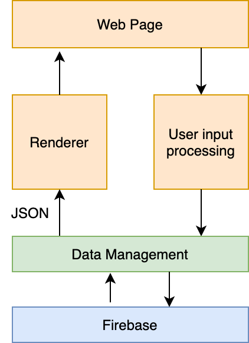

# Planning Descisions

## Status Updates

[click here](status)

## High Level Discussions

1. **Way of working**
The project is broken down into many small functions
The functions required are listed in the subdirectories for each part of the structure (shown below)
There will be at least 1x .js file per structure item.

2. **Structure**
   * 
   * [**Web page**](web_page) - A HTML document with minimal JS. Includes a landing page, then a page with a blank canvas
   * [**User Input Processing**](user_input) - Reads user button presses, mouse movements, touch events, clicks and calls all the required functions. Player-assist graphics (like direction worm is aiming) are sent to the renderer and not the state.
   * [**State Manipulator**](state_manipulator) - Uses the currect game state and the new input to calculate the next state. Here will be the character-to-map interactions, applying physics to movement, etc.
   * [**Data Management**](data_management) - Can be simple, can be complicated, but overall must allow user input to smoothly modify the state. i.e. lag from server to client should be nulled.
   * [**Firebase**]((firebase)) - single point which all players communicate with
   * [**Renderer**](renderer) - Uses the state to draw the scene to the webpage
  
   **Vlad**: I'm a bit concerned about the backend, trying to write files on the server depends of service etc.. and can results in buggs and errors. I've worked with JSON and PHP and it's easy. Agree with string being sent to database and string being called from database in function of game id. Straight forward. Reading a file will be slow for the server if using a small homemade one. Not trivial setup.

   **Vlad**: Realtime databases seem what we need -> good point trying to understand how they work. firebase looks powerfull and easy to integrate. fairly secure as well as google and fast as you said.
  
3. **Tools**
Everything is possible with Vanilla JS and our bare hands. If we use tools, we'll be more productive and our final prodcut will perform better. **Note** It's good for us to follow the modern best practices
3.1. Webpack - Makes it easier / possible to create many different js files. 
3.2. TypeScript - We're working as a team, which means we should try not to commit things which can break the other person. TypeScript will help us rookies write less buggy code. But... you have to compile it to .js before you can use it. We already have to compile though to make WebPack work. TypeScript is the future.
3.3 SVG.js - Using a library to draw SVG will speed us up, and will speed up our final product. Expect to use SVG for landscapes, where it can randomly be "redrawn" after weapon impact

4. **Graphics library**
Use SVG (2D)
Use a library, either snap.js or svg.js because drawing lots of objects in svg can get pretty messy! Library is 60KB, so quite heavy, but only loaded once. Probably available from Google CDN.
Three.js is really good for 3D. We can put the SVG into this tool. For example if we wanted to make the board 3D. But later
   **Vlad**: SVG.js only shortens vanilla by around 50%. We can use it if you think it's worth the overhead to loading.

5. **Resolution**
Eventually it needs to work on all devices. Design for desktop first but be very concious of smaller screens. Eventually it will by dynamic resolution

   **Vlad**: Agree with this. Resize and window size check quite easy in vanilla. The content of the canvas needs to be fixed to a setting. need to add button that selects the size of the content inside the window to display. Some people might prefer larger or samller game features in function of vision and display size. e.g. select worm size 10px, always this size unless changed in settings - everything else proportional to one selectable dimension.

6. **Libraries**
Try not to use jquery?
socket library
svg / snap .js
Maybe external font
but for sure try to minimize it

   1. **Vlad**: Agree. Try to use vanilla for everything unless real benefit. Any library will be an overhead to BW.

7. **Design**
   * Should fit all in one screen, that is annoying about current worms
   * Use an image as the background. Worms and weapons are drawn
   * On Desktop, use mouse to aim and shoot. On phone there should be a 'fire' button, and aim with finger

   1. **Vlad**:
   -Agree.
   -Distructable terrain by pixel or block of pixels. Need to add some physics: curvature of throw, impact, elesticity of bounce.
   -Agree

8. **Number of players**
   * Start with multiplayer so we don't have to build a bot :)

   1. **Vlad**:Agree

9. **Data Storage**
   * We shouldn't need a database unless we need to retain data for days. I was imagining an array of strings. Each entry in the array is a string. The string is a JSON. It looks like JSON's can be compressed in BSON's.

**Vlad**: Agree. Point 6.

**Vlad**: Let's consider netlify.com for website storage, can be linked to github.

## Delegations

| Preference | Will              | Vlad |
|------------|-------------------|------|
| 1          | Backend + Sockets |      |
| 2          | Input processing  |      |
| 3          | SVG drawing       |      |
| 4          | Webpage           |      |
